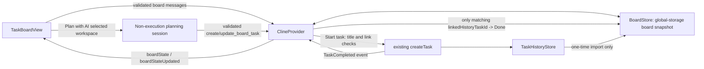

# Technical plan — workspace-first Tasks board

## Inputs and delivery boundary

- Business-analysis input: `C:\Repositories\Zoo-Code\.github\memory\session\bro-workflows\20260728T132009Z-iteration-01-workspace-first-board-planning-cb8b\business-analysis.md`
- Product specification reviewed: `docs/kanban-redesign.md` (the **Workspace-first planning workflow** section supersedes the earlier history-derived model).
- This slice replaces the current desktop Tasks board's read model only. It retains the Tasks destination in `App.tsx`, the persistent shell, normal execution task lifecycle, and the standalone per-task Kanban editor.

The minimum deliverable is three observable behaviours:

1. A user creates/selects a logical board workspace, creates a blank card in any stage, edits/moves/deletes it, restarts the extension, and sees the same persisted card in the selected workspace.
2. A user opens planning for the selected logical workspace; the planning context identifies that workspace, and approved planning produces board cards only, never `HistoryItem` records or execution conversations.
3. A user starts a titled unlinked card once; the created normal execution task is linked to that card, and completion moves only that linked card to Done.

## Current-system fit

The repository already has a five-column Tasks board, but it is still an execution-history projection:

- `packages/types/src/history.ts` defines `BoardStage` on `HistoryItem`.
- `src/core/task-persistence/TaskHistoryStore.ts` persists execution records per task and defaults new history records to Backlog.
- `src/core/webview/ClineProvider.ts` exposes `updateTaskBoardStage()` and turns all completed history tasks into Done.
- `webview-ui/src/components/board/TaskBoardView.tsx` filters/groups `taskHistory`, while `TaskBoardCard.tsx` opens `showTaskWithId` and uses history deletion controls.

Those structures cannot represent an empty card and violate the new source-of-truth boundary. `HistoryItem.boardStage`, `taskBoardStageChanged`, `updateTaskBoardStage()`, history-derived card filtering, and automatic completion-to-Done must therefore be removed in the same implementation, rather than maintained as a second stage system.

The existing persistence conventions are suitable to reuse: `TaskHistoryStore` serializes mutations, writes atomically through `safeWriteJson`, maintains a cache, and treats unreadable persistence as recoverable. The new store must apply the equivalent failure behaviour without sharing task-history files or lifecycle semantics.

## Recommended approach and trade-offs

Add a dedicated board domain and a single `BoardStore`, backed by a versioned board snapshot under extension global storage. Keep a single board mutation authority in `ClineProvider`; the webview receives snapshots/incremental updates and never edits local board state optimistically as its source of truth.

**Why this approach**

- It makes title `""` legal and preserves a blank card independently of a chat task.
- It makes workspace selection independent of `cwd` and avoids coupling cards to VS Code workspace filtering.
- It provides one host-side validation boundary for webview messages and LLM tools.
- It permits a narrow one-time import from the existing `TaskHistoryStore` without changing or deleting history.

**Trade-offs**

- A separate store deliberately duplicates IDs/timestamps/stage values that history already has. That is required to separate planning data from execution data.
- A single snapshot file is simpler than per-card files and sufficient for this local board slice. It must be written through `safeWriteJson` and protected by an in-process mutation queue; cross-device synchronization and multi-process reconciliation are deferred.
- Planning must be a non-execution chat path. The existing `newTask` message creates a `Task`, and `Task` persists an execution conversation; it cannot be reused for planning without violating acceptance criterion 2. Reuse model/provider configuration and native-tool plumbing, but introduce an explicitly non-history planning-session path rather than hiding a normal task.

## Architecture and data flow

### Board domain and persisted snapshot

Create `packages/types/src/board.ts` and export it from `packages/types/src/index.ts`:

- `BoardWorkspace`: `id`, required non-blank `name`, `createdAt`, `updatedAt`, optional `linkedWorkspacePath`.
- `BoardTask`: `id`, `workspaceId`, valid `BoardStage`, `position`, `createdAt`, `updatedAt`, `title` (empty string allowed), optional `description`, optional `linkedHistoryTaskId`.
- `boardStageSchema` moves from `history.ts` to this board module; define Zod schemas for persisted records and validated tool/message payloads.
- `BoardState`: `version`, `selectedWorkspaceId?`, `workspaces`, `tasks`, and `migrations` with a `historyImport` version marker.

Create `src/core/board/BoardStore.ts`. It owns initialization, a serialized read-modify-write queue, snapshot validation/recovery, and CRUD/move operations. Store the JSON snapshot below `contextProxy.globalStorageUri.fsPath` at a new name added to `src/shared/globalFileNames.ts` (for example `board.json`), using `safeWriteJson`. On malformed/missing data, log and initialize an empty valid state; never modify task-history storage.

`ClineProvider` creates/initializes the store alongside `TaskHistoryStore`, puts the board snapshot in `ExtensionState`, and emits `boardStateUpdated` after every successful board mutation. Extend `ExtensionStateContext` to replace its board snapshot from both initial state and incremental updates.

### Host contracts

Extend `packages/types/src/vscode-extension-host.ts` with:

- `ExtensionState.boardState`;
- `ExtensionMessage` type `boardStateUpdated` plus a typed `boardState` payload;
- discriminated `WebviewMessage` types/payload fields for workspace CRUD/select, card CRUD/move, `startBoardTask`, planning-session open/focus, and folder selection result.

`webviewMessageHandler.ts` validates all runtime data with the schemas before calling provider methods: non-empty trimmed workspace names, existing workspace/task IDs, a task belonging to its specified workspace, valid `BoardStage`, finite non-negative `position`, optional strings only, non-empty title for `startBoardTask`, and a currently unlinked card before execution starts. Invalid messages are logged and ignored without persisting partial data.

Add `ClineProvider` methods that map each validated request to one store operation and then broadcast the resulting board state. Deleting a workspace deletes only its BoardTasks in the board snapshot; deleting a BoardTask never calls `deleteTaskWithId`. For linked cards, do not permit a second start; expose/open the existing task instead.

### Migration and execution linkage

During board-store initialization, after task history is available, run a version-gated import exactly once:

- When history is non-empty and the import marker is absent, create `Imported tasks`, import only records without `parentTaskId` as linked cards, map `status === "completed"` to Done and all other records to Backlog, and persist the marker with the snapshot.
- When history is empty, persist the migration marker without creating an empty imported workspace. A later history change must not re-run import.
- Preserve every `HistoryItem` and do not import children/delegated tasks.

`startBoardTask()` rechecks the latest BoardTask in the store, rejects empty/whitespace-only titles and existing links, calls the existing top-level `createTask(title)` path once, then atomically writes the returned execution ID to `linkedHistoryTaskId`. If execution creation fails, leave the board card unlinked. If linking fails after creation, surface and log an actionable recovery error instead of retrying task creation.

The existing provider task-completion listener must look up linked BoardTasks and change only matching cards to Done. Remove the current unconditional history `boardStage: "done"` writes. No other history event creates, moves, deletes, or changes board cards.

### Planning chat and board tools

Implement an explicitly non-execution planning session controller in `src/core/board/BoardPlanningSession.ts`, owned by `ClineProvider` and surfaced through the existing dock/chat rendering only as necessary. It receives the selected `boardWorkspaceId`, workspace name, and optional `linkedWorkspacePath` as planning metadata. It must not call `createTask()`, `newTask`, `TaskHistoryStore`, or normal execution-history broadcasts.

Register `create_board_task` and `update_board_task` with the existing native tool pipeline:

- definitions in `src/core/prompts/tools/native-tools/` and registration in `native-tools/index.ts`;
- tool-name/parameter typing in `packages/types/src/tool.ts` and its native tool argument definitions;
- tool implementations in `src/core/tools/`, which resolve the planning-session context and call provider board methods.

The planning prompt/controller instructs the model to clarify and propose first. It enables those tools only after explicit user approval recorded in the planning session; tools validate their supplied workspace/task/stage values again at the provider/store boundary. The tools can only mutate BoardTasks in the active planning workspace and return an error for stale/deleted workspace IDs. They never delegate through `NewTaskTool` or create normal tasks.

## Affected files and interfaces

| File | Change |
|---|---|
| `packages/types/src/board.ts` (new) | Board records, schemas, stage type, snapshot and input contracts. |
| `packages/types/src/index.ts` | Export board domain. |
| `packages/types/src/history.ts` | Remove `BoardStage`, schema, and `HistoryItem.boardStage`. |
| `packages/types/src/vscode-extension-host.ts` | Board state, host-to-webview broadcasts, and typed webview requests. |
| `packages/types/src/tool.ts` and existing native tool parameter typings | Add the two board tool names/arguments. |
| `src/shared/globalFileNames.ts` | Add the board snapshot filename. |
| `src/core/board/BoardStore.ts` (new) | Atomic local board snapshot, CRUD/move, selection, migration marker. |
| `src/core/board/BoardPlanningSession.ts` (new) | Non-execution planning context, approval gate, and chat lifecycle. |
| `src/core/webview/ClineProvider.ts` | Store lifecycle, board state/broadcasts, migration, start/link, completion linkage, planning-session ownership; remove history board-stage behaviour. |
| `src/core/webview/webviewMessageHandler.ts` | Validate and route board requests; remove `taskBoardStageChanged`. |
| `src/core/prompts/tools/native-tools/index.ts` plus new tool definition files | Expose `create_board_task` / `update_board_task`. |
| `src/core/tools/` plus registration path | Implement validated board-only tool execution. |
| `webview-ui/src/context/ExtensionStateContext.tsx` | Consume board state and incremental updates. |
| `webview-ui/src/components/board/TaskBoardView.tsx` | Replace `taskHistory` search/filter/selection/deletion UI with selected logical workspace, workspace controls, empty state, Plan with AI, New task, and workspace-scoped board state. |
| `webview-ui/src/components/board/TaskBoardColumn.tsx` | Add the accessible Add task operation and board-task list. |
| `webview-ui/src/components/board/TaskBoardCard.tsx` | Inline title/description editing, blank placeholder, manual move, card-only delete, and titled-card Start/open-linked-task behaviour. |
| `webview-ui/src/components/board/boardStage.ts` | Consume board-domain stages only; retain visual stage order/swatch metadata. |
| `webview-ui/src/components/history/useTaskSearch.ts` | Do not reuse for board data; retain only for history consumers. |
| `webview-ui/src/components/history/*` | Keep existing history UI for its remaining chat uses; the board must stop importing task-history deletion/footer components. |
| `src/core/task-persistence/TaskHistoryStore.ts` | Remove board-stage default/merge handling; otherwise leave execution persistence unchanged. |

## Ordered implementation behaviours

1. **Persisted logical workspace and blank-card board.** Add the typed board snapshot/store, selection and one-time history import; replace the history-derived board UI and contracts with selected-workspace CRUD, card CRUD/moves, inline blank-card editing, and card-only deletion. A fresh user sees the required create-workspace state; no filesystem workspace is inferred.
2. **Approval-gated planning.** Add the non-execution planning session and the two board-only native tools; wire Plan with AI to the selected workspace and block tool mutation until explicit approval. Approved calls visibly add/update cards in that workspace without a `HistoryItem` or execution conversation.
3. **Explicit execution handoff.** Implement titled-card start/link idempotency and the completion listener's linked-card-only Done update. Existing execution task creation remains authoritative; history remains unchanged when cards are created, moved, planned, or deleted.

## Explicit deferrals

- Drag-and-drop, arbitrary reordering UI, and bulk board-card operations; the `position` field is persisted for stable per-stage order and future ordering, while this slice only assigns a deterministic end position on create/move.
- Cloud/cross-device synchronization, sharing, import/export, collaboration, assignments, labels, estimates, due dates, dependencies, templates, and analytics.
- Folder security expansion or changing VS Code's open workspace; a folder link is display/planning metadata only.
- Broader task-history cleanup, history UI redesign, per-task Kanban changes, mobile UI, Settings, Marketplace, rail, and chat-dock visual polish.
- Generalizing the new board store into a reusable persistence framework, retry/repair UI beyond safe recovery/logging, and nonessential localization beyond the strings necessary to perform this flow.

## Dependencies, compatibility, security, and reliability

- No new package is required: use existing Zod, `safeWriteJson`, VS Code global storage, native-tool registration, and React/shadcn controls.
- Existing history remains readable and is not deleted or rewritten by board migration. Removing `HistoryItem.boardStage` is a breaking internal contract, so all producers/consumers/tests must be removed in the same change.
- Treat webview messages and LLM tool arguments as untrusted. Validate at both adapter and provider/store boundaries; scope planning tools to the active planning workspace; prohibit cross-workspace task mutation and execution creation.
- Escape/render board titles/descriptions as text, not injected HTML. Preserve the existing highlighted-history rendering only in history components.
- Atomic file replacement prevents partial snapshot writes. Schema validation and an empty-state recovery path prevent corrupted board data from crashing activation. Serialization prevents local read-modify-write races, especially move/start/completion overlap.
- Migration is idempotent by version marker. Workspace deletion removes board data only; it must neither call task-history deletion nor remove execution files. A start/link failure must never invoke a second execution-task creation automatically.

## Design involvement

No separate design asset is required. Reuse existing Task-board column styling and controls. Design review is limited to confirming the create-workspace empty state, workspace actions, inline empty-card focus, and the explicit planning approval/start-task affordances are understandable in narrow sidebar and editor contexts.

## Verification strategy

Use the narrowest applicable layers:

- **Board store unit tests** in `src/core/board/__tests__/BoardStore.spec.ts`: schema recovery, serialized CRUD/move, empty title validity, workspace cascade deletion without history calls, selected workspace persistence, stable position, and migration idempotency/top-level filtering/status mapping.
- **Provider/handler unit tests** beside current `ClineProvider.taskHistory.spec.ts` and `webviewMessageHandler.taskBoardStageChanged.spec.ts`: reject malformed/cross-workspace inputs; verify board broadcasts; start exactly once and link on success; no link on execution failure; completion changes only the matching linked card; no automatic completion effect on unlinked cards.
- **Planning tool/session tests** beside existing native-tool and tool tests: selected workspace metadata is supplied, approval is required, valid calls use only board mutations, and invalid/stale IDs/stages are rejected with no history/task creation.
- **Webview tests** replacing `webview-ui/src/components/board/__tests__/TaskBoardView.spec.tsx`: create-workspace state, selected-workspace scoping, Add task for every stage, focused `Untitled task` inline edit, reload snapshot rendering, manual move, board-only delete, Plan with AI request, and titled/unlinked versus linked Start behaviour. Remove the old history-card/stage-select expectations.
- **Regression checks:** run the affected `packages/types`, `src`, and `webview-ui` type checks and unit suites. Perform one focused desktop smoke walkthrough: create workspace without changing VS Code folder; add/move/reload a blank card; approve planning and verify no history entry; start a titled card; complete its execution task; verify only that card reaches Done; verify existing history and standalone per-task Kanban remain intact.

## Technical risks and blockers

- **Primary implementation risk:** the current chat model is task-centric—`newTask` calls `ClineProvider.createTask()`, which creates a `Task` and execution persistence. Planning cannot use that route. The implementation must establish the non-execution planning-session boundary before exposing Plan with AI.
- **Link atomicity risk:** external execution-task creation and board snapshot persistence cannot be one filesystem transaction. Mitigate by linking only after successful creation, never automatic retrying creation, and giving a recoverable/logged outcome if the subsequent link write fails.
- **Migration risk:** imported tasks must only be top-level and only once. Cover no-history, existing-history, repeated startup, and corrupt-snapshot cases.
- **No blocker:** repository evidence is sufficient and no current external API/library fact is required.

## Web research evidence and planning implications

Research not required: repository evidence was sufficient. The active requirements, existing history-derived board, task persistence conventions, native-tool pipeline, and task-completion lifecycle establish the compatible implementation path. No external compatibility, security, or library claim is necessary for this plan.
