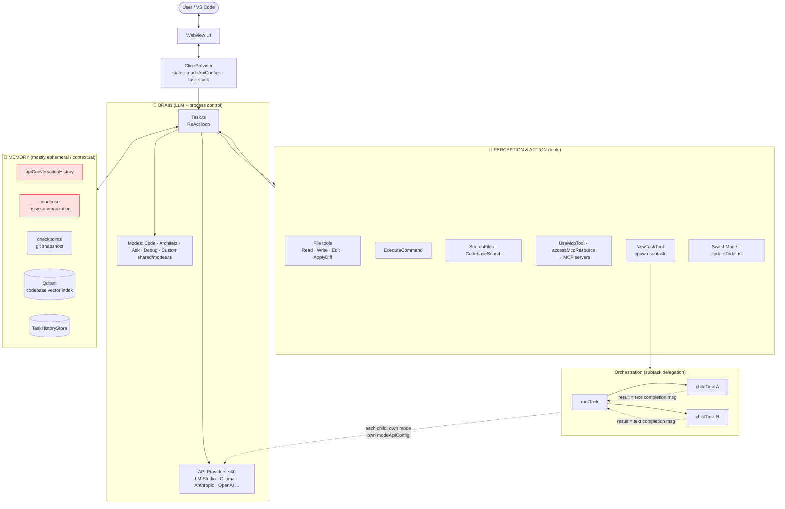
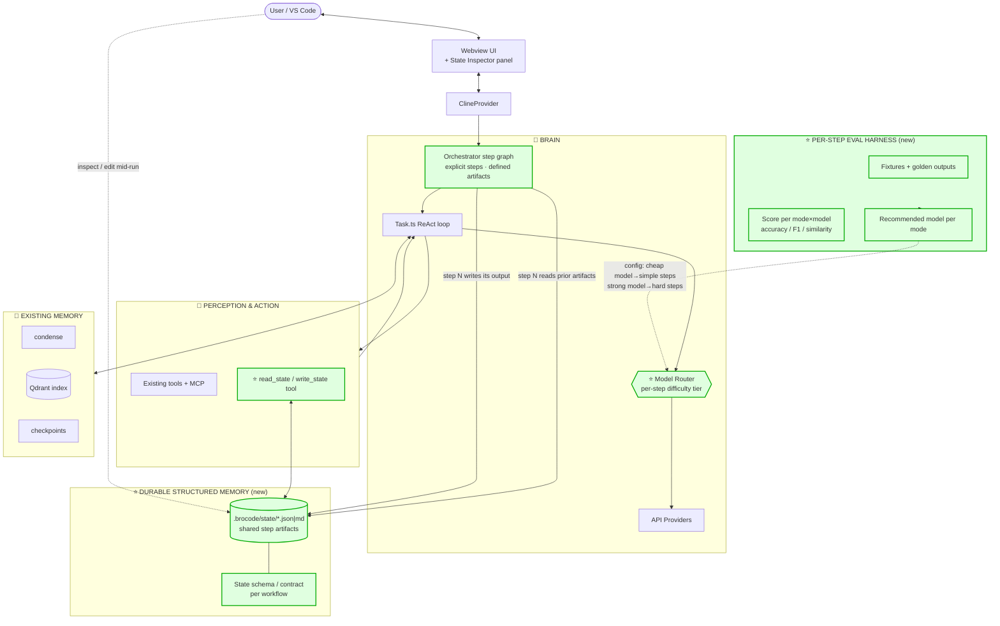

# Applying MRAgent Patterns to Bro Code

This doc maps the MRAgent architecture (see [MRAgent-understanding.md](MRAgent-understanding.md)) onto Bro Code's actual implementation, and proposes where to optimize.

MRAgent is, stripped of the biology, a **fixed-workflow ReAct agent with file-based memory, per-step tools, and per-step model selection**. Almost every one of its ideas maps onto a primitive Bro Code already has, which is why it's a useful mirror.

## How the paradigms map

| MRAgent layer                        | Bro Code equivalent                                                                  |
| ------------------------------------ | ------------------------------------------------------------------------------------ |
| 🧠 **Brain** (LLM + process control) | `Task.ts` ReAct loop + ~40 API providers + Modes (`shared/modes.ts`)                 |
| 💾 **Memory** (CSV data sheets)      | conversation history + `condense` (lossy summarization) + checkpoints + Qdrant index |
| 🔧 **Perception & Action** (toolkit) | tool suite (`src/core/tools/*`) + MCP servers                                        |
| Fixed 9-step workflow                | Orchestration via `NewTaskTool` → parent/child/root task stack                       |
| Per-step model selection             | `modeApiConfigs` (each mode can bind its own provider profile)                       |

The key difference: MRAgent persists structured, human-editable state to disk and re-reads it each step. Bro Code's subtask hand-off is a single **text completion message**, and long-task state survives only through lossy `condense` summarization.

## Diagram 1 — Current Bro Code implementation

The red nodes are the constraint: **cross-step state lives only in the conversation history, and survives long tasks only through lossy `condense` summarization.** Subtask→parent hand-off is a single text message — no durable, structured, human-editable artifact. That's exactly the gap MRAgent's "data-sheet memory" fills.

## Diagram 2 — Optimized: MRAgent patterns layered in

## What changed (green = new), in priority order

1. **Durable structured memory** (`.brocode/state/*`) + a `read_state`/`write_state` tool — the direct analog of MRAgent's CSV data sheets. Subtasks hand off _structured artifacts on disk_ instead of a text blob, the user can inspect/edit mid-run (the State Inspector panel), and long workflows stop depending on lossy `condense`. **Highest leverage, most defensible.**
2. **Model Router** — turns the existing `modeApiConfigs` from a static per-mode binding into per-_step_ difficulty-tiered routing (cheap local model for trivial steps, strong model for the hard one). The plumbing already exists; this is the cheap win.
3. **Per-step eval harness** — fixtures + golden outputs scoring each mode×model, which _feeds_ the router's recommendations. Answers the "model choice matters / try a stronger one" hand-wave in the README with actual numbers, and it's genuinely differentiating for a local-first tool.

> Note: the orchestrator is deliberately kept as a **generic step graph**, not MRAgent's hardcoded 9-step pipeline — the transferable asset is the _pattern_ (externalized state + step decomposition + per-step routing), not the fixed biology workflow.

## Why this fits Bro Code specifically

- It directly attacks the **context-bleed problem** that plagues long multi-step / orchestrated tasks.
- It plays to Bro Code's **local-first** premise: cheap local LM Studio models for trivial steps, a strong model only where judgment is needed — backed by data from the eval harness rather than guesswork.
- MRAgent independently validates a feature Bro Code already ships: Claude-3-opus failed MRAgent's STROBE-MR step purely on **JSON formatting**, which is exactly what the "Detect tool calls written as plain JSON text" fallback mitigates for less-tool-tuned local models.
